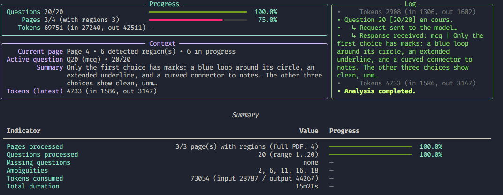
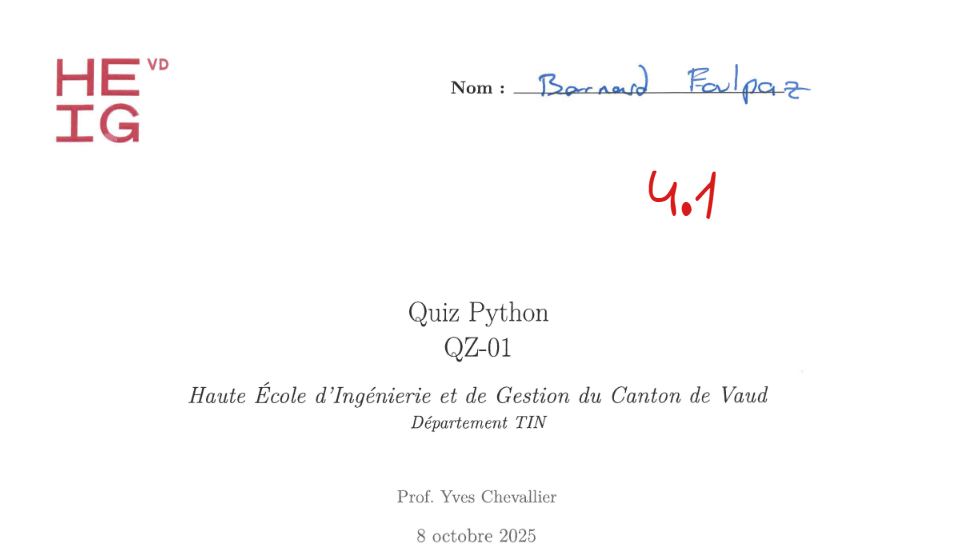
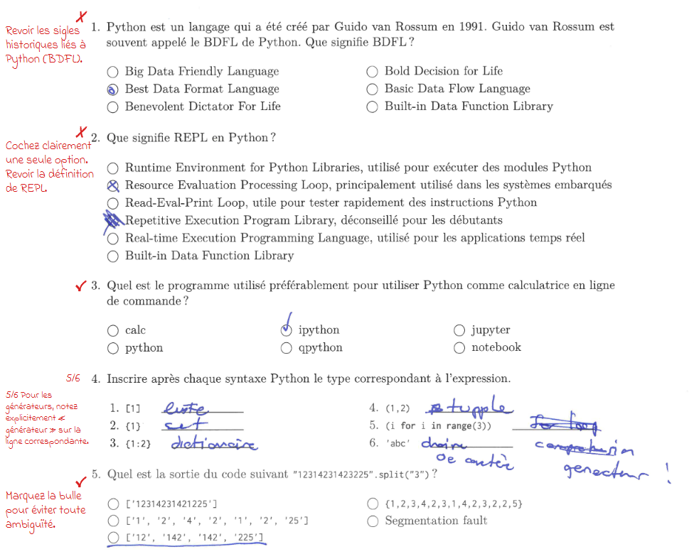

# Quiz-AI Automated Grading Pipeline

Quiz-AI explores how Large Language Models (LLMs) can help grade paper-based quizzes with minimal manual intervention. The project turns a traditional workflow (author quiz → print → collect papers → grade) into a reproducible pipeline that keeps the human-designed rubric intact while letting LLMs perform the repetitive visual inspection and scoring.

## What the Module Does

- **Authoring**: Teachers describe quizzes in YAML. The schema captures the text, model answers, scoring rules, and any per-question metadata needed for grading.
- **Production**: The YAML is converted to LaTeX and compiled to PDF so it can be printed and handed out exactly as designed.
- **Digitisation**: After the exam, all completed sheets are scanned back into a single PDF, which is then split into per-student packets and per-question crops.
- **LLM Evaluation**: Each cropped response is sent to the configured LLM for visual analysis. The LLM produces structured observations that are later fed into a grading prompt.
- **Grading and Reporting**: A second LLM call combines the observations, the original quiz definition, and grading rules to attribute scores, rationales, and feedback. Reports and annotated PDFs are generated to share with students.

## Why Anchors Matter

Anchors describe where each question lives inside the source PDF. They are extracted once from the LaTeX output and reused for every batch of scanned copies. This gives three benefits:

- **Consistent segmentation**: The same coordinates are applied across all student copies, guaranteeing that each crop lines up with the intended question.
- **LLM cost control**: Anchors let us isolate only the relevant portion of a page so we do not send redundant context to the vision model.
- **Traceability**: Because every cropped image can be traced back to its anchor, it is easy to debug misalignments or revisit a response without re-processing the full scan.

## Multi-Pass Analysis Methodology

The pipeline is intentionally broken into explicit phases. Splitting the work makes the system easier to reason about, test, and re-run when something fails.

1. **Quiz authoring (`quiz.yaml`)**: Define questions, rubrics, acceptable answers, and scoring weights in a structured format.
2. **LaTeX conversion (`quizai latex`)**: Translate YAML to LaTeX templates so the paper exam matches the digital rubric 1:1.
3. **Anchor extraction (`quizai anchors`)**: Generate JSON coordinates that locate every question and answer box in the final PDF. These anchors are versioned alongside the quiz source.
4. **Scan ingestion (`quizai analysis`)**: Start from the scanned PDF, split it per student, break pages into images, and crop them using the anchors. The command can work with pre-computed anchors or infer positions directly from the source PDF, depending on the scan quality.
5. **Per-question visual analysis**: Each cropped image is sent to the vision-capable LLM (e.g., GPT-5) to describe what the student wrote or drew. The output is stored as intermediate JSON so it can be inspected or manually corrected before grading.
6. **Grading synthesis (`quizai grade-one` / `quizai grade`)**: Combine quiz metadata, the LLM observations, and the scoring rubric into a grading prompt. The grading LLM returns point allocations and feedback messages.
7. **Reporting (`quizai report`, `quizai annotate`)**: Build aggregated reports (Markdown, JSON) and optional annotated PDFs that overlay feedback directly onto the scanned pages.

Because each stage produces artifacts on disk, you can re-run only the stages that need adjustment (for example, regenerate anchors after changing the layout, or redo grading with a tweaked prompt) without repeating the entire workflow.

## Technology Stack

- **Python 3.12**: Primary language for the CLI and processing scripts.
- **Typer**: Command-line interface framework that exposes the pipeline stages as subcommands.
- **OpenAI API**: Provides the vision and language models used for analysis and grading.
- **PyMuPDF, pdf2image**: Assist with PDF manipulation, page splitting, and rasterisation.
- **ReportLab, SVGLib**: Generate annotated PDFs and vector overlays for feedback.
- **Pydantic, PyYAML**: Validate structured data exchanged between stages.

### Tips for Running the Pipeline

- Version the YAML quiz definition, LaTeX output, and anchor files together to guarantee reproducibility.
- Store intermediate analysis JSON files; they are valuable for auditing and for training future grading prompts.
- When scans are noisy, inspect the cropped images before sending them to the LLM—rerunning `quizai analysis` is cheaper than re-grading.

## Intended Outcomes

- **Faster turnaround**: Reduce manual marking time by letting LLMs perform first-pass grading while keeping humans in the loop for final approval.
- **Consistent grading**: The rubric lives in source control, so scoring logic does not drift between cohorts.
- **Extensible foundation**: Each stage is modular, making it straightforward to swap LLM providers, change report formats, or add domain-specific checks.

## Demo

### Extracting Anchors

```bash
$ quiz-ai anchors demo/exam/exam.pdf > out/anchors.json
```

### Analyzing a Student's Scan

```bash
$ quiz-ai analysis -a out/anchors.json demo/quiz-bernard-foulpaz.pdf
```



### Grading a Student's Responses

```bash
$ quiz-ai grading analysis/analysis.json demo/exam.yml -o analysis
Grading saved → analysis/grading.json (10.50/20.00 pts, 52.5 %)
```

Go and see by yourself the [grading.json](out/grading.json) file generated for this student.

### Generating Personalized Feedback

```bash
$ quiz-ai feedback out/grading.json
Bonjour Bernard Foulpaz,

Bravo pour vos résultats au Quiz Python. Votre note calculée est de 4.08
(12.33/20, soit 61.65 %). Je tiens à souligner vos réussites: bonne
compréhension des itérateurs (__iter__/next), des effets de référence
sur les listes (append), des compréhensions de listes simples, des paramètres
nommés et de la méthode spéciale __init__. Vous avez également bien mené un
petit programme de calculatrice en ligne de commande, prévu correctement la
sortie de "12314231423225".split("3"), importé sqrt sans polluer l’espace de
noms, et expliqué avec justesse le typage dynamique.

Pour continuer à progresser, consolidez les notions factuelles et de
vocabulaire: la signification de BDFL et de REPL, le rôle exact de pip et
l’usage de virtualenv/venv. Renforcez aussi les conventions objet: la définition
de self, la distinction entre noms d’actions (méthodes) et variables d’état
(attributs), et associez chaque syntaxe Python à son type. Un bon plan
d’entraînement est de créer une petite classe en nommant clairement méthodes et
attributs, d’écrire un itérateur simple et de manipuler next, puis de monter un
environnement virtuel pour installer un paquet avec pip. Des fiches mémo sur les
sigles et une relecture du tutoriel officiel vous aideront à ancrer ces bases.

Dernier point méthodologique: à l’examen, marquez une seule bulle par question
avec une coche nette, sans cercles ambigus ni soulignements.

Poursuivez sur cette lancée: les fondamentaux se renforcent vite avec un
entraînement ciblé. Courage, vous êtes sur la bonne trajectoire.

L'assistant artificiel de votre professeur

```

```bash
$ quiz-ai annotate -g out/grading.json demo/quiz-bernard-foulpaz.pdf \
                   -a out/anchors.json out/quiz-bernard-foulpaz-annotated.pdf
Annotated PDF generated → out/quiz-bernard-foulpaz-annotated.pdf
```



